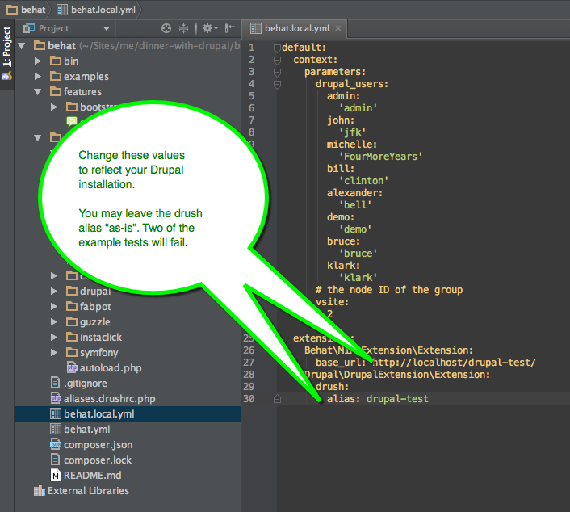
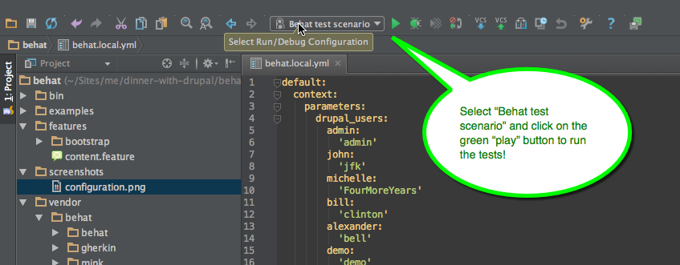

Drubehat
========
Boilerplate configuration for using Behat with your Drupal 7 site. This configuration includes the full dependencies so that you do not need to install Composer.

Installation
========
1. Make sure you have a clean empty Drupal 7 installation running on your development machine (or VM box).
2. Download the ZIP for this repository.
3. Unzip the file in a directory of your choice.
4. Start PHPStorm, click "Open..." and select the directory "drubehat" that you just unzipped.
6. Open up the file ```behat.local.yml``` and fill in the two values for the ```base_url``` and the ```drush alias```, as illustrated below.
7. Run the example tests! See screenshot below.

Configuration screenshot
=========


Run the tests
=========
