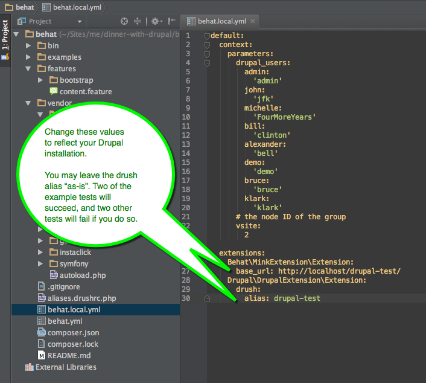

Drubehat
========
This repository contains the basic configuration necessary to run Behat tests from within PHPStorm. Included are:

1. Behat configuration.
2. Sample tests (adapted from [OpenScholar](https://www.drupal.org/project/openscholar)).
3. PHPStorm Run configuration to run the tests.

You will need
========
1. PHPStorm. [Download and install a free trial of PHPStorm (free for one month)](https://www.jetbrains.com/phpstorm/).
2. A working, clean, [Drupal 7 site](https://www.drupal.org/download) on your development machine (or VM box).

Installation
========
1. [Download the ZIP for this repository](https://github.com/mauzeh/drubehat/archive/master.zip).
2. Unzip the file in a directory of your choice.
3. Start PHPStorm, click "Open..." and select the directory ```drubehat-master/``` that you just unzipped.
4. Install the required dependencies. Inside PHPStorm, open the Terminal (see screenshot below) and enter ```$ php composer.phar install```
5. Open up the file ```behat.local.yml``` and fill in the two values for the ```base_url``` and the ```drush alias```, as illustrated below.
6. Run the example tests! See screenshot below.

Install the required dependencies
========


Configuration
=========


Run the tests
=========

